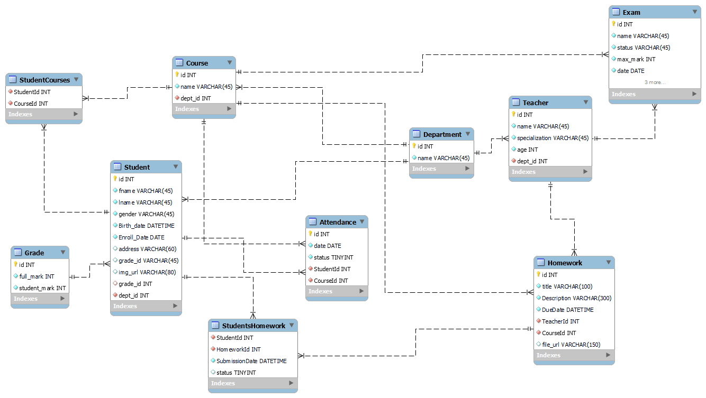

# 📚 Go School Management System

A comprehensive RESTful API for managing school operations built with Go, featuring student management, course enrollment, attendance tracking, homework assignments, exams, and grading systems.



## 🎯 Overview

This project is a backend API system designed to handle the complete lifecycle of school management operations. It provides a robust, scalable solution for educational institutions to manage their academic and administrative processes.

### Key Features

- 👨‍🎓 **Student Management**: Complete student profile and enrollment management
- 👨‍🏫 **Teacher Management**: Teacher profiles and course assignments
- 📖 **Course Management**: Course creation, scheduling, and student enrollment
- 🏢 **Department Management**: Organizational structure and department hierarchy
- ✅ **Attendance Tracking**: Real-time attendance monitoring and reporting
- 📝 **Homework System**: Assignment creation, submission, and tracking
- 📊 **Exam Management**: Exam scheduling and administration
- 🎓 **Grading System**: Comprehensive grade management and reporting

---

## 🏗️ Architecture

This project follows **Clean Architecture** principles with a modular, layered design pattern:

```
┌─────────────────────────────────────────────────────┐
│                   HTTP Layer (Gin)                  │
│                    Controllers                       │
├─────────────────────────────────────────────────────┤
│                  Business Logic                      │
│                     Services                         │
├─────────────────────────────────────────────────────┤
│                   Data Access                        │
│                   Repositories                       │
├─────────────────────────────────────────────────────┤
│                Database (PostgreSQL)                 │
│                    GORM ORM                          │
└─────────────────────────────────────────────────────┘
```

### Design Patterns

- **Repository Pattern**: Abstraction of data access logic
- **Service Layer Pattern**: Business logic separation
- **DTO Pattern**: Request/Response data transformation
- **Dependency Injection**: Loose coupling between layers
- **Modular Design**: Domain-driven module organization

---

## 📁 Project Structure

```
go-school-management/
├── cmd/
│   └── server/
│       └── main.go                 # Application entry point
├── internal/
│   ├── config/
│   │   └── config.go              # Configuration management
│   ├── database/
│   │   └── postgres.go            # Database connection & setup
│   ├── server/                    # Server setup (routes, middleware)
│   └── modules/                   # Business domain modules
│       ├── student/               # Student module
│       │   ├── student_model.go
│       │   ├── student_dto.go
│       │   ├── student_repository.go
│       │   ├── student_service.go
│       │   └── student_controller.go
│       ├── teacher/               # Teacher module
│       ├── course/                # Course module
│       ├── department/            # Department module
│       ├── attendance/            # Attendance module
│       ├── homework/              # Homework module
│       ├── students_homework/     # Student homework submissions
│       ├── student_courses/       # Student-course enrollment
│       ├── exam/                  # Exam module
│       └── grade/                 # Grade module
├── pkg/                           # Shared utilities
│   ├── logger/                    # Logging utilities
│   ├── response/                  # API response formatting
│   ├── validation/                # Input validation
│   └── middleware/                # HTTP middleware
├── .env                           # Environment variables (not in git)
├── .gitignore
├── go.mod                         # Go module dependencies
├── go.sum
├── init_project.sh                # Project scaffolding script
├── school_db.png                  # Database ERD diagram
└── README.md                      # This file
```

### Module Structure

Each business module follows a consistent 5-layer pattern:

| File              | Purpose                                             |
| ----------------- | --------------------------------------------------- |
| `*_model.go`      | Database entity definition (GORM models)            |
| `*_dto.go`        | Data Transfer Objects (request/response structures) |
| `*_repository.go` | Database operations (CRUD)                          |
| `*_service.go`    | Business logic implementation                       |
| `*_controller.go` | HTTP request handlers                               |

---

## 🗄️ Database Schema (ERD)

The system uses **PostgreSQL** with the following entity relationships:

### Core Entities

1. **Students**: Student profiles and personal information
2. **Teachers**: Teacher profiles and credentials
3. **Courses**: Course definitions and schedules
4. **Departments**: Academic departments and organizational units
5. **Attendance**: Student attendance records
6. **Homework**: Homework assignments
7. **Students_Homework**: Student homework submissions (junction table)
8. **Student_Courses**: Student course enrollments (junction table)
9. **Exams**: Exam definitions and schedules
10. **Grades**: Student grades and assessment results

### Key Relationships

- **Students ↔ Courses**: Many-to-Many (via `student_courses`)
- **Students ↔ Homework**: Many-to-Many (via `students_homework`)
- **Students → Attendance**: One-to-Many
- **Students → Grades**: One-to-Many
- **Teachers ↔ Courses**: One-to-Many or Many-to-Many
- **Courses → Departments**: Many-to-One
- **Courses → Exams**: One-to-Many
- **Courses → Homework**: One-to-Many

> 📊 See [school_db.png](school_db.png) for the complete Entity-Relationship Diagram

---

## 🛠️ Technology Stack

| Component             | Technology              | Version  |
| --------------------- | ----------------------- | -------- |
| **Language**          | Go                      | 1.23+    |
| **Web Framework**     | Gin                     | v1.11.0  |
| **Database**          | PostgreSQL              | Latest   |
| **ORM**               | GORM                    | v1.25.10 |
| **Database Driver**   | pgx/v5 + lib/pq         | v5.6.0   |
| **Config Management** | godotenv                | v1.5.1   |
| **Validation**        | go-playground/validator | v10.27.0 |

---

## 🚀 Getting Started

### Prerequisites

- **Go** 1.23 or higher
- **PostgreSQL** 12 or higher
- **Git**

### Installation

1. **Clone the repository**

   ```bash
   git clone <repository-url>
   cd go-school-management
   ```

2. **Install dependencies**

   ```bash
   go mod download
   ```

3. **Set up environment variables**

   Create a `.env` file in the root directory:

   ```env
   # Application
   APP_PORT=8080

   # Database
   DB_HOST=localhost
   DB_PORT=5432
   DB_USER=postgres
   DB_PASSWORD=your_password
   DB_NAME=school_db
   DB_SSLMODE=disable
   ```

4. **Start PostgreSQL**

   Make sure PostgreSQL is running on your system.

5. **Run the application**

   ```bash
   go run cmd/server/main.go
   ```

   The application will:

   - Load configuration from `.env`
   - Create the database if it doesn't exist
   - Connect to PostgreSQL
   - Start the HTTP server on the configured port

6. **Verify the server**
   ```bash
   curl http://localhost:8080/
   # Expected: "Hello, World!"
   ```

---

## 📝 Configuration

All configuration is managed through environment variables:

| Variable      | Description                | Default     |
| ------------- | -------------------------- | ----------- |
| `APP_PORT`    | HTTP server port           | `8080`      |
| `DB_HOST`     | PostgreSQL host            | `localhost` |
| `DB_PORT`     | PostgreSQL port            | `5432`      |
| `DB_USER`     | Database user              | `postgres`  |
| `DB_PASSWORD` | Database password          | _(empty)_   |
| `DB_NAME`     | Database name              | `school_db` |
| `DB_SSLMODE`  | SSL mode for DB connection | `disable`   |

---

## 🔧 Development

### Project Scaffolding

The project structure was generated using the included `init_project.sh` script:

```bash
bash init_project.sh
```

This creates all module folders and files following the established pattern.

### Adding a New Module

To add a new business module:

1. Create the module directory:

   ```bash
   mkdir -p internal/modules/your_module
   ```

2. Create the 5 standard files:

   ```bash
   cd internal/modules/your_module
   touch your_module_model.go
   touch your_module_dto.go
   touch your_module_repository.go
   touch your_module_service.go
   touch your_module_controller.go
   ```

3. Implement each layer following the existing patterns

### Code Organization

- **Models**: Define GORM structs with database tags
- **DTOs**: Define request/response structures with JSON tags
- **Repositories**: Implement database CRUD operations
- **Services**: Implement business logic and validation
- **Controllers**: Handle HTTP requests and responses

---

## 🧪 Testing

_(To be implemented)_

```bash
# Run all tests
go test ./...

# Run tests with coverage
go test -cover ./...

# Run tests for a specific module
go test ./internal/modules/student/...
```

---

## 📚 API Documentation

_(To be implemented)_

API documentation will be available via:

- Swagger/OpenAPI specification
- Postman collection
- Interactive API explorer

### Planned Endpoints

```
Students:
  GET    /api/v1/students
  GET    /api/v1/students/:id
  POST   /api/v1/students
  PUT    /api/v1/students/:id
  DELETE /api/v1/students/:id

Teachers:
  GET    /api/v1/teachers
  GET    /api/v1/teachers/:id
  POST   /api/v1/teachers
  PUT    /api/v1/teachers/:id
  DELETE /api/v1/teachers/:id

Courses:
  GET    /api/v1/courses
  GET    /api/v1/courses/:id
  POST   /api/v1/courses
  PUT    /api/v1/courses/:id
  DELETE /api/v1/courses/:id

... (similar patterns for other modules)
```

---

## 🔐 Security

_(To be implemented)_

Planned security features:

- JWT-based authentication
- Role-based access control (RBAC)
- Request rate limiting
- Input validation and sanitization
- SQL injection prevention (via GORM)
- CORS configuration

---

## 🚧 Current Status

### ✅ Completed

- [x] Project structure and scaffolding
- [x] Configuration management
- [x] Database connection setup
- [x] Module organization
- [x] Basic HTTP server

### 🔄 In Progress

- [ ] Database models and migrations
- [ ] Repository implementations
- [ ] Service layer logic
- [ ] API controllers and routes
- [ ] Shared utilities (logger, response, validation)

### 📋 Planned

- [ ] Authentication & authorization
- [ ] API documentation (Swagger)
- [ ] Unit and integration tests
- [ ] Docker containerization
- [ ] CI/CD pipeline
- [ ] Logging and monitoring
- [ ] Error handling middleware

---

## 🤝 Contributing

Contributions are welcome! Please follow these guidelines:

1. Fork the repository
2. Create a feature branch (`git checkout -b feature/amazing-feature`)
3. Commit your changes (`git commit -m 'Add amazing feature'`)
4. Push to the branch (`git push origin feature/amazing-feature`)
5. Open a Pull Request

### Code Style

- Follow Go best practices and idioms
- Use `gofmt` for code formatting
- Write meaningful commit messages
- Add tests for new features
- Update documentation as needed

---

## 📄 License

_(To be determined)_

---

## 👥 Authors

_(Add your information here)_

---

## 🙏 Acknowledgments

- [Gin Web Framework](https://github.com/gin-gonic/gin)
- [GORM](https://gorm.io/)
- [PostgreSQL](https://www.postgresql.org/)
- Go community for excellent tooling and libraries

---

## 📞 Support

For questions or support:

- Open an issue on GitHub
- Contact the development team
- Check the documentation

---

**Built with ❤️ using Go**
